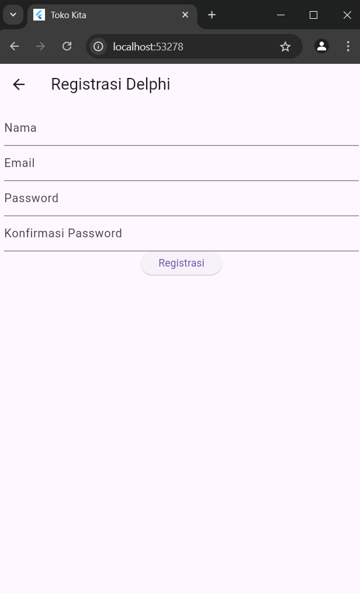
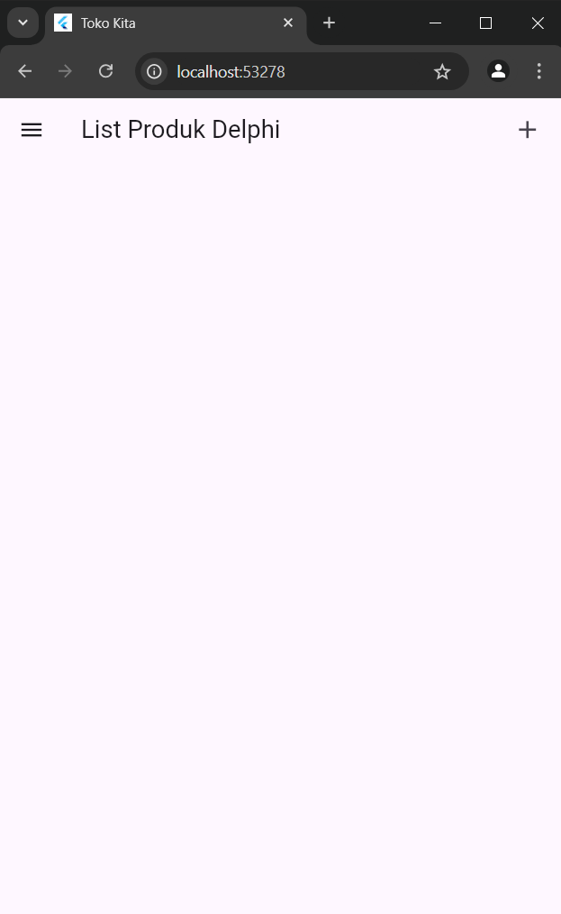
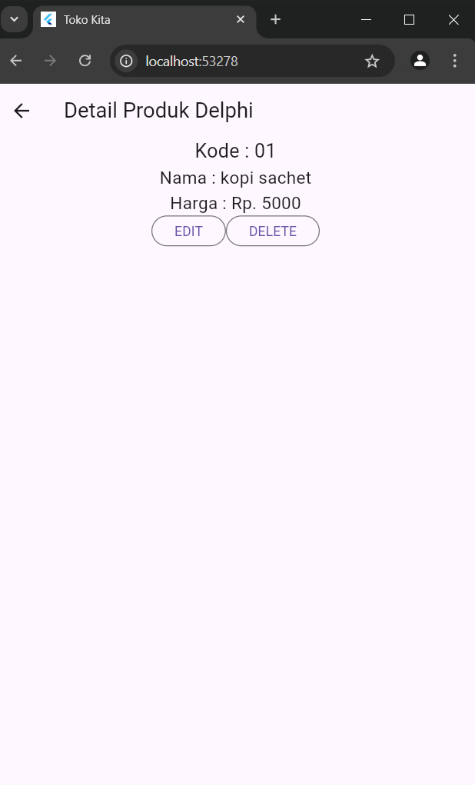
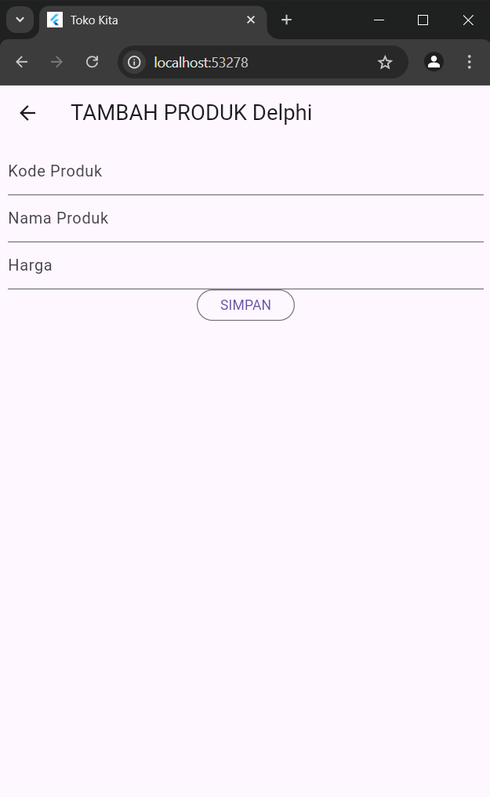

## Screenshot

1. **Tampilan Login**

2. **Tampilan Registrasi**

3. **Tampilan List Produk**

4. **Tampilan Detail Produk**

5. **Tampilan Ubah Produk**

6. **Tampilan Tambah Produk**

7. **Tampilan Logout**

# Penjelasan Proses Aplikasi
1. **Proses Registrasi**
a. Input data

Pada proses ini, pengguna diharuskan untuk mengisi nama, email, password, serta konfirmasi password pada form yang tersedia. Data ini kemudian dikirim ke server lalu disimpan di database.
Berikut kode yang bertugas untuk mengirim data ke API di file registrasi_page.dart:
   RegistrasiBloc.registrasi(
   nama: \_namaTextboxController.text,
   email: \_emailTextboxController.text,
   password: \_passwordTextboxController.text)
b. Pop-up Sukses Registrasi

Setelah berhasil mendaftar, pop up ini akan muncul lalu pengguna diarahkan untuk login.
   showDialog(
   context: context,
   barrierDismissible: false,
   builder: (BuildContext context) => SuccessDialog(
   description: "Registrasi berhasil, silahkan login",
   okClick: () {
   Navigator.pop(context);
   },
   ),
   );

2. **Proses Login**
a. Input Data

Pengguna diharuskan untuk mengisi email dan password sesuai dengan data yang dimasukkan saat registrasi. Data ini dikirim ke API untuk proses autentikasi:
Berikut kodenya yang ada di dalam file login_page.dart:
   LoginBloc.login(
   email: \_emailTextboxController.text,
   password: \_passwordTextboxController.text)
b. Berhasil Login

Jika login berhasil, pengguna akan diarahkan ke halaman daftar produk
   Navigator.pushReplacement(context,
   MaterialPageRoute(builder: (context) => const ProdukPage()));
Jika login tidak berhasil, maka akan muncul pop up yang berasal dari kode berikut:
   showDialog(
   context: context,
   barrierDismissible: false,
   builder: (BuildContext context) => const WarningDialog(
   description: "Login gagal, silahkan coba lagi",
   ));

3. **Proses Tambah Data Produk**
a. Tambah Data Produk Baru

Pengguna mengisi data data yang dibutuhkan. Data akan dikirim ke server lalu ditambah ke database.
   Produk createProduk = Produk(id: null);
   createProduk.kodeProduk = \_kodeProdukTextboxController.text;
   createProduk.namaProduk = \_namaProdukTextboxController.text;
   createProduk.hargaProduk = int.parse(\_hargaProdukTextboxController.text);
   ProdukBloc.addProduk(produk: createProduk).then((value) {
   Navigator.of(context).push(MaterialPageRoute(
   builder: (BuildContext context) => const ProdukPage()));
   }
b. Berhasil Tambah Data

Data akan ditampilkan di Detail Produk setelah berhasil ditambahkan

4. **Proses Detail Produk**
a. Melihat Detail Produk

Saat pengguna memilih produk dari daftar, detail produk akan ditampilkan menggunakan halaman detail:
   Navigator.push(
   context,
   MaterialPageRoute(
   builder: (context) => ProdukDetail(produk: produk)
   )
   );

5. **Proses Ubah Produk**
a. Input Data untuk Ubah Produk

Pengguna dapat mengubah kode produk, nama produk, atau harga produk di halaman ubah produk. Perubahan ini kemudian disimpan di database:
   Produk updateProduk = Produk(id: widget.produk!.id!);
   updateProduk.kodeProduk = \_kodeProdukTextboxController.text;
   updateProduk.namaProduk = \_namaProdukTextboxController.text;
   updateProduk.hargaProduk = int.parse(\_hargaProdukTextboxController.text);
   ProdukBloc.updateProduk(produk: updateProduk).then((value) {
   Navigator.of(context).push(MaterialPageRoute(
   builder: (BuildContext context) => const ProdukPage()));
   }
b. Berhasil Ubah Data Produk

Berhasil mengubah harga produk dari 5k menjadi 7k.

6. **Proses Hapus Produk**
a. Konfirmasi Hapus Produk

Saat pengguna mengklik tombol hapus, sebuah dialog konfirmasi akan muncul untuk memastikan apakah pengguna ingin menghapus produk:
   OutlinedButton(
   child: const Text("Ya"),
   onPressed: () {
   ProdukBloc.deleteProduk(id: (widget.produk!.id!)).then(
   (value) => {
   Navigator.of(context).push(MaterialPageRoute(
   builder: (context) => const ProdukPage()))
   }, onError: (error) {
   showDialog(
   context: context,
   builder: (BuildContext context) => const WarningDialog(
   description: "Hapus gagal, silahkan coba lagi",
   ));
   });
   },
   ),

   //tombol batal
   OutlinedButton(
   child: const Text("Batal"),
   onPressed: () => Navigator.pop(context),
   )
b. Berhasil Hapus Data Produk

Berhasil hapus data produk gula.

7. **Proses Logout**
a. Tombol Logout

Pengguna dapat logout dari sistem dengan menekan tombol logout. Ini akan menghapus sesi pengguna dan mengarahkan kembali ke halaman login:
   ListTile(
   title: const Text('Logout Delphi'),
   trailing: const Icon(Icons.logout),
   onTap: () async {
   await LogoutBloc.logout().then((value) => {
   Navigator.of(context).pushAndRemoveUntil(
   MaterialPageRoute(
   builder: (context) => const LoginPage()),
   (route) => false)
   });
   },
   ),
